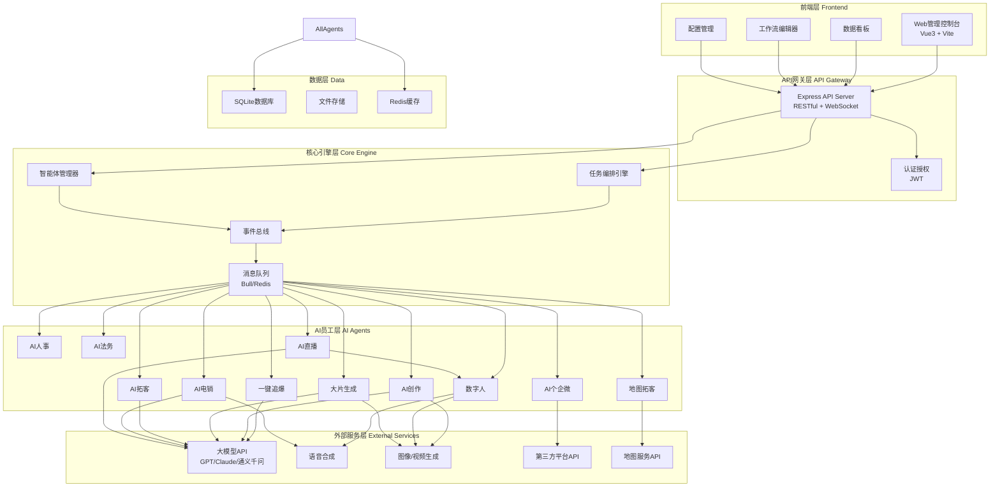

# AI智能体AI员工系统 - 技术设计

Feature Name: ai-employee-system
Updated: 2026-04-30

## Description

一套包含11个AI岗位智能体的自动化运营系统，面向一人公司、自媒体、电商、实体店、小工作室。系统采用模块化架构，支持24小时自动运转，通过可视化配置实现"设置一次终身受益"的目标。

## Architecture



## Components and Interfaces

### 1. Web管理控制台

**技术栈**: Vue 3 + TypeScript + Vite + Element Plus

```
src/
├── views/
│   ├── Dashboard.vue          # 数据看板
│   ├── Agents.vue             # AI员工管理
│   ├── Workflow.vue           # 工作流编辑器
│   ├── Config.vue             # 系统配置
│   ├── ContentHub.vue         # 内容中心
│   ├── Leads.vue              # 线索管理
│   ├── Reports.vue            # 报表中心
│   └── Settings.vue           # 系统设置
├── components/
│   ├── AgentCard.vue          # 智能体卡片组件
│   ├── WorkflowNode.vue       # 工作流节点组件
│   ├── ChartWidget.vue        # 图表组件
│   └── ConfigForm.vue         # 配置表单组件
└── stores/
    ├── agent.ts               # 智能体状态管理
    ├── workflow.ts            # 工作流状态管理
    └── dashboard.ts           # 看板数据管理
```

### 2. API服务端

**技术栈**: Node.js + Express + TypeScript + SQLite + Redis

```
server/
├── src/
│   ├── index.ts               # 入口文件
│   ├── config/
│   │   └── database.ts        # 数据库配置
│   ├── routes/
│   │   ├── agents.ts          # 智能体管理路由
│   │   ├── workflows.ts       # 工作流路由
│   │   ├── content.ts         # 内容管理路由
│   │   ├── leads.ts           # 线索管理路由
│   │   ├── dashboard.ts       # 数据看板路由
│   │   └── settings.ts        # 系统配置路由
│   ├── controllers/
│   │   └── ...                # 控制器
│   ├── services/
│   │   ├── AgentService.ts    # 智能体服务
│   │   ├── WorkflowService.ts # 工作流服务
│   │   ├── ContentService.ts  # 内容服务
│   │   └── LeadService.ts     # 线索服务
│   ├── agents/                # AI员工实现
│   │   ├── BaseAgent.ts       # 基类
│   │   ├── TrendAgent.ts      # 一键追爆
│   │   ├── CreateAgent.ts     # AI创作
│   │   ├── AvatarAgent.ts     # 数字人
│   │   ├── VideoAgent.ts      # 大片生成
│   │   ├── ProspectAgent.ts   # AI拓客
│   │   ├── MapAgent.ts        # 地图拓客
│   │   ├── WeChatAgent.ts     # AI个企微
│   │   ├── HRAgent.ts         # AI人事
│   │   ├── LegalAgent.ts      # AI法务
│   │   ├── CallAgent.ts       # AI电销
│   │   └── LiveAgent.ts       # AI直播
│   ├── scheduler/
│   │   ├── TaskScheduler.ts   # 任务调度器
│   │   ├── EventBus.ts        # 事件总线
│   │   └── WorkflowEngine.ts  # 工作流引擎
│   ├── integrations/          # 外部服务集成
│   │   ├── llm.ts             # 大模型集成
│   │   ├── tts.ts             # 语音合成
│   │   ├── vision.ts          # 图像视频生成
│   │   └── platforms.ts       # 第三方平台
│   └── models/
│       ├── Agent.ts           # 智能体模型
│       ├── Workflow.ts        # 工作流模型
│       ├── Content.ts         # 内容模型
│       ├── Lead.ts            # 线索模型
│       └── Task.ts            # 任务模型
├── migrations/                # 数据库迁移
└── package.json
```

### 3. 数据库设计

```
Tables:
├── agents
│   ├── id (PK)
│   ├── name
│   ├── type (enum: trend/create/avatar/video/prospect/map/wechat/hr/legal/call/live)
│   ├── status (enum: active/paused/stopped)
│   ├── config (JSON)
│   ├── schedule (JSON)
│   ├── last_run_at
│   ├── total_runs
│   ├── success_count
│   ├── fail_count
│   ├── created_at
│   └── updated_at
├── workflows
│   ├── id (PK)
│   ├── name
│   ├── description
│   ├── nodes (JSON)
│   ├── edges (JSON)
│   ├── is_active
│   ├── trigger_type (enum: schedule/event/manual)
│   ├── trigger_config (JSON)
│   ├── created_at
│   └── updated_at
├── tasks
│   ├── id (PK)
│   ├── workflow_id (FK)
│   ├── agent_id (FK)
│   ├── status (enum: pending/running/success/failed)
│   ├── input (JSON)
│   ├── output (JSON)
│   ├── error_message
│   ├── started_at
│   └── completed_at
├── contents
│   ├── id (PK)
│   ├── type (enum: text/image/video/audio)
│   ├── title
│   ├── body (TEXT)
│   ├── source_agent_id (FK)
│   ├── source_url
│   ├── tags (JSON)
│   ├── status (enum: draft/published/archived)
│   ├── publish_platform (JSON)
│   ├── metrics (JSON)
│   ├── created_at
│   └── updated_at
├── leads
│   ├── id (PK)
│   ├── source (enum: prospect/map/wechat/call/live)
│   ├── name
│   ├── company
│   ├── phone
│   ├── email
│   ├── tags (JSON)
│   ├── intent_level (enum: high/medium/low/unknown)
│   ├── status (enum: new/contacted/qualified/converted/lost)
│   ├── notes (TEXT)
│   ├── assigned_to
│   ├── created_at
│   └── updated_at
└── settings
    ├── key (PK)
    ├── value (JSON)
    ├── description
    └── updated_at
```

### 4. 核心接口定义

#### 智能体基类 (BaseAgent)

```typescript
interface AgentConfig {
  id: string;
  name: string;
  type: AgentType;
  enabled: boolean;
  schedule?: CronExpression;
  parameters: Record<string, unknown>;
}

interface AgentResult {
  success: boolean;
  data?: unknown;
  error?: string;
  metrics?: {
    duration: number;
    itemsProcessed: number;
    itemsSucceeded: number;
    itemsFailed: number;
  };
}

abstract class BaseAgent {
  abstract type: AgentType;
  abstract execute(context: AgentContext): Promise<AgentResult>;
  abstract validateConfig(config: AgentConfig): boolean;
  getStatus(): AgentStatus;
  pause(): void;
  resume(): void;
}
```

#### 事件总线 (EventBus)

```typescript
type EventName =
  | 'agent.started'
  | 'agent.completed'
  | 'agent.failed'
  | 'content.created'
  | 'content.published'
  | 'lead.discovered'
  | 'lead.qualified'
  | 'workflow.triggered'
  | 'workflow.completed';

interface EventBus {
  on(event: EventName, handler: EventHandler): void;
  off(event: EventName, handler: EventHandler): void;
  emit(event: EventName, payload: EventPayload): Promise<void>;
}
```

#### 工作流引擎 (WorkflowEngine)

```typescript
interface WorkflowNode {
  id: string;
  type: 'trigger' | 'agent' | 'condition' | 'action';
  config: Record<string, unknown>;
  position: { x: number; y: number };
}

interface WorkflowEdge {
  id: string;
  source: string;
  target: string;
  condition?: string;
}

interface Workflow {
  id: string;
  name: string;
  nodes: WorkflowNode[];
  edges: WorkflowEdge[];
  trigger: TriggerConfig;
}
```

### 5. 各AI员工模块说明

#### 5.1 TrendAgent (一键追爆)

```
工作流程:
1. 定时扫描热点源API (抖音热搜/微博热搜/小红书热榜)
2. 提取热点关键词、话题、互动数据
3. 与用户行业/领域匹配过滤
4. 生成追爆选题报告
5. 触发AI创作Agent生成内容

数据源:
- 抖音热点宝API
- 微博热搜API
- 小红书内容API
- 新榜API
```

#### 5.2 CreateAgent (AI创作)

```
功能模块:
- 文案生成: 基于大模型的多平台文案生成
- 图片生成: 调用图像生成API (Midjourney/DALL-E/通义万相)
- 脚本生成: 短视频脚本/直播话术/广告脚本
- 批量创作: 支持一次性生成多版本内容

支持平台模板:
- 抖音 (短视频文案、标题、话题)
- 小红书 (种草笔记、图文搭配)
- 微信公众号 (长文排版)
- 朋友圈 (短文案+配图)
```

#### 5.3 AvatarAgent (数字人)

```
技术方案:
- 预设形象: 使用预渲染的数字人模型
- 口型同步: Wav2Lip/SadTalker 实现音文对口型
- 动作驱动: 基于文本语义自动匹配手势和表情
- 场景合成: 数字人+背景+字幕一体化渲染

输出格式: MP4 1080p/4K
```

#### 5.4 VideoAgent (大片自动生成)

```
处理流程:
1. 解析输入文案/脚本
2. 按场景拆分内容段落
3. 匹配素材库画面 (或使用AI生成画面)
4. 添加字幕 (大模型自动生成+时间轴)
5. 配置背景音乐和音效
6. 添加转场特效
7. 渲染输出

技术依赖:
- FFmpeg (视频合成)
- 大模型 (脚本分析/字幕生成)
- 素材库 (视频片段/图片/BGM)
```

#### 5.5 ProspectAgent (AI拓客)

```
拓客渠道:
- 企业信息平台 (企查查/天眼查)
- 社交媒体 (LinkedIn/脉脉)
- 行业展会/活动名单
- 公开招标信息

筛选维度:
- 行业分类
- 地区范围
- 企业规模
- 关键决策人
- 近期动态

触达方式:
- 邮件 (自动模板+个性化)
- 短信
- 社交平台私信
```

#### 5.6 MapAgent (地图拓客)

```
数据源:
- 高德地图POI API
- 百度地图API
- Google Maps API (海外)

功能:
1. 地图上圈选目标区域
2. 提取区域内POI数据
3. 按行业/评分/规模筛选
4. 生成外联名单
5. 规划拜访路线
```

#### 5.7 WeChatAgent (AI个企微)

```
功能:
- 自动回复: 基于FAQ知识库+大模型理解
- 朋友圈: 定时发布+智能配文配图
- 群管理: 欢迎语+关键词回复+违规检测
- 客户分层: 自动打标签+RFM模型
- 意向识别: NLP分析聊天内容判断意向

技术实现:
- 企业微信开放API
- 个人微信 RPA (wxauto/itchat)
```

#### 5.8 HRAgent (AI人事)

```
功能:
- 简历筛选: 解析简历+岗位匹配度评分
- 面试问答: AI初步面试(文字/语音)
- 考勤管理: 打卡记录+异常统计
- 员工问答: 制度查询+流程咨询
- 报表生成: 月度人事数据汇总

知识库:
- 公司规章制度
- 常见HR流程
- 劳动法基础
```

#### 5.9 LegalAgent (AI法务)

```
功能:
- 合同审查: 条款风险分析+修改建议
- 合同生成: 基于模板的自动合同起草
- 法律咨询: 基于法律知识库的问答
- 合规提醒: 行业法规更新推送
- 案例检索: 相似法律案例推荐

免责声明: 所有建议仅供参考,重要事项需专业律师确认
```

#### 5.10 CallAgent (AI电销)

```
技术方案:
- ASR: 语音识别 (阿里云/讯飞)
- NLP: 对话理解 (大模型)
- TTS: 语音合成 (逼真人声)
- 外呼平台: 对接通信API

对话流程:
1. 开场白 → 自我介绍+来意
2. 需求探询 → 了解客户情况
3. 产品介绍 → 针对性介绍
4. 异议处理 → 常见问题解答
5. 意向确认 → 判断意向等级
6. 结束语 → 预约下一步或礼貌结束

意向分级:
- A级: 明确需求,愿意进一步了解
- B级: 有兴趣,需要后续跟进
- C级: 暂无需求,保持联系
- D级: 明确拒绝,不再打扰
```

#### 5.11 LiveAgent (AI直播)

```
功能:
- 数字人主播: 24小时不间断直播
- 商品讲解: 自动介绍商品卖点
- 互动回复: 实时回复观众评论
- 上下架管理: 自动控制商品展示
- 数据分析: 实时看板监控直播效果

策略:
- 高流量时段: 重点商品+促销话术
- 低流量时段: 互动+留存策略
- 自动逼单: 限时优惠+库存提示
```

## Correctness Properties

1. **数据一致性**: 所有AI员工的操作结果必须持久化到数据库,确保系统重启后状态不丢失
2. **幂等性**: 重复执行同一任务不应产生重复结果(如重复发送消息)
3. **事务安全**: 关键操作(如客户线索入库)必须使用事务保证原子性
4. **超时控制**: 所有外部API调用必须设置超时(默认30秒),超时后重试或标记失败
5. **资源隔离**: 各AI员工独立运行,一个员工异常不影响其他员工

## Error Handling

| 错误类型 | 处理策略 |
|---------|---------|
| 大模型API限流 | 指数退避重试(1s→2s→4s→8s),超过最大重试后标记任务失败并通知 |
| 外部服务不可用 | 重试3次后降级为本地模式(如有),记录错误日志 |
| 任务执行超时 | 超过60秒强制终止,标记失败,生成错误报告 |
| 数据库异常 | 回滚事务,记录详细错误日志,触发告警 |
| AI生成内容不合规 | 内容审核拦截,标记需人工审核 |
| 配置缺失/错误 | 启动时校验配置,阻止错误配置的智能体启动 |

## Test Strategy

### 单元测试
- 每个AI员工的 execute() 方法独立测试
- 配置验证逻辑测试
- 数据模型CRUD操作测试
- 工具函数和helper测试

### 集成测试
- 工作流引擎端到端测试
- 多智能体协同测试
- 数据库事务测试
- 外部API集成测试(使用mock)

### 用户验收测试
- 预设场景验证 (电商追爆→创作→发布 完整链路)
- 并发压力测试 (11个智能体同时运行)
- 长时间稳定性测试 (72小时不间断运行)

### 测试覆盖率目标
- 行覆盖率 > 80%
- 分支覆盖率 > 70%
- 关键路径 100% 覆盖

## References

[^1]: (Vue3) - https://vuejs.org/
[^2]: (Express.js) - https://expressjs.com/
[^3]: (Bull Queue) - https://github.com/OptimalBits/bull
[^4]: (FFmpeg) - https://ffmpeg.org/
[^5]: (企业微信API) - https://developer.work.weixin.qq.com/
[^6]: (高德地图API) - https://lbs.amap.com/
